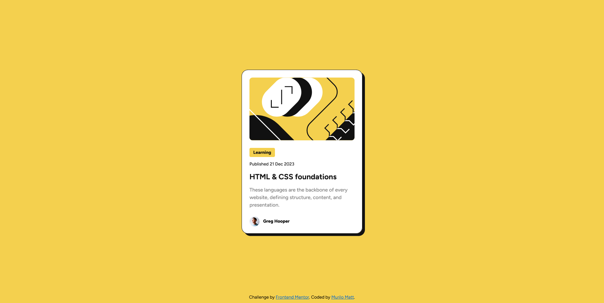

# Frontend Mentor - Blog preview card solution

This is a solution to the [Blog preview card challenge on Frontend Mentor](https://www.frontendmentor.io/challenges/blog-preview-card-ckPaj01IcS). Frontend Mentor challenges help you improve your coding skills by building realistic projects. 

## Table of contents

- [Overview](#overview)
  - [The challenge](#the-challenge)
  - [Screenshot](#screenshot)
  - [Links](#links)
- [My process](#my-process)
  - [Built with](#built-with)
  - [What I learned](#what-i-learned)
- [Author](#author)

## Overview

### The challenge

Users should be able to:

- See hover and focus states for all interactive elements on the page

### Screenshot



### Links

- Solution URL: [My Solution](https://muliromatt.github.io/blog-review-card/)

## My process

### Built with

- Semantic HTML5 markup
- CSS custom properties
- Flexbox
- SASS

### What I learned

I learned how to make my webpage responsive without having to use media queries.
To do so, I used `clamp()`.

Here's an example:

```css
.card-component {
  width: clamp(327px, 90%, 384px);
}
```

## Author

- Frontend Mentor - [@yourusername](https://www.frontendmentor.io/profile/MuliroMatt)
- Linkedin - [Murilo Amorim Mattiuzzi](https://www.linkedin.com/in/murilo-amorim-mattiuzzi-6589752ab/)